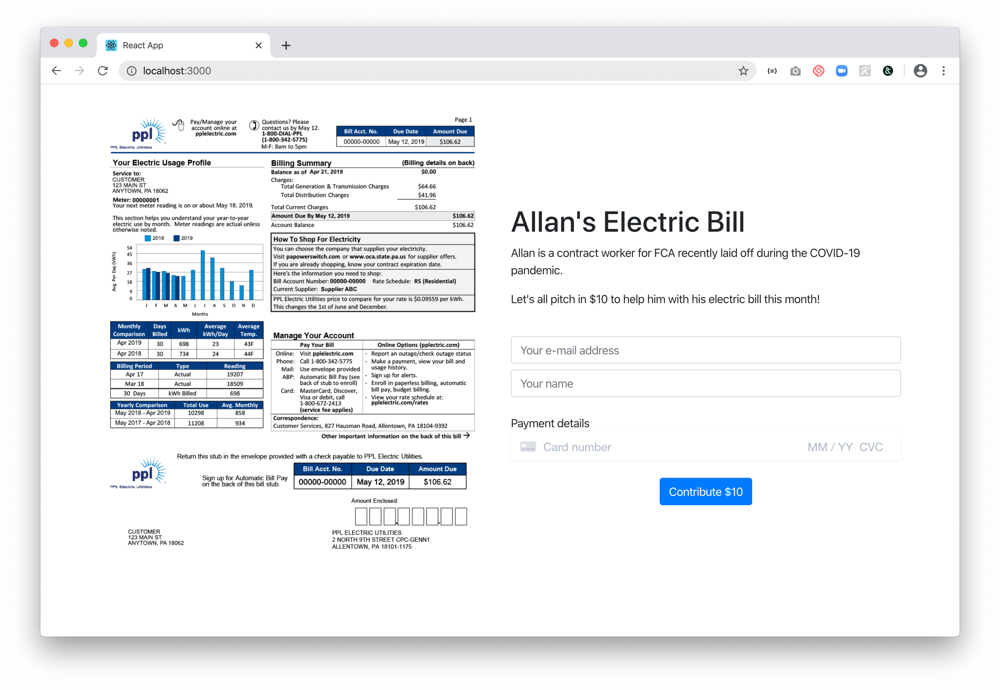

# Stripe PaymentIntents

This is an application that uses Stripe PaymentIntents to let a user make a one-time purchase.

## Install system dependencies
```bash
$ brew install node  # if "node -v" command not found
$ brew install yarn  # if "yarn -v" command not found
$ brew install stripe/stripe-cli/stripe  # if "stripe" command not found
```

## Clone the repo
```bash
$ git clone git@github.com:albertinator/stripe-paymentintents.git
```

## Set up
First get your Stripe **publishable key** and **secret key** from [https://dashboard.stripe.com/apikeys](https://dashboard.stripe.com/apikeys). Then run:
```bash
$ echo REACT_APP_STRIPE_PK=<your stripe publishable key> > .env
$ echo STRIPE_SK=<your stripe secret key> > server/.env
$ yarn install
$ cd server && yarn install && cd ..
```

## Run and monitor
Open 3 different shell terminals and run the following in each, respectively:

```bash
$ yarn dev  # this will run both the client (on port 3000) and server (on port 5000)
```

```bash
$ stripe login
$ stripe listen --forward-to http://localhost:5000/webhook  # forward webhooks from Stripe
```

```bash
$ touch server/successful_payments.log
$ tail -f server/successful_payments.log  # watch successful payments log
```

## Use the app

Navigate to [http://localhost:3000](http://localhost:3000)

In this app, we present an opportunity to help someone displaced from his job due to COVID-19 pay his electric bill this month.



Enter your e-mail address and name, and finally your credit card details:
* `4242 4242 4242 4242` - start with the plain vanilla success card

Look at your window monitoring Stripe webhooks from `stripe listen`: it should have captured a webhook for this successful payment.

Also look at your window monitoring the successful payments log from `tail -f server/successful_payments.log`: it should have added a new line with the PaymentIntent ID.

Refresh the page to contribute more. Try the following alternative cases:

* `4000 0025 0000 3155` - require authentication

After the extra step of authenticating, this should result in a successful payment and add a new line to `server/successful_payments.log`.

* `4000 0000 0000 9995` - declined for `insufficient_funds`

This should NOT result in a successful payment and NO new line should be added to `server/successful_payments.log`.
